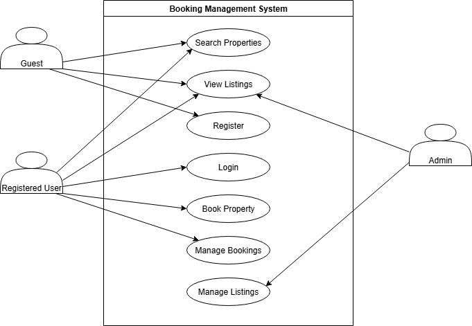

# Requirement Analysis in Software Development

## Introduction
This repository is dedicated to documenting the process of **Requirement Analysis**, a critical phase in the Software Development Life Cycle (SDLC).  

The purpose of this repository is to provide a structured blueprint of how requirements are gathered, analyzed, and documented for a software system.  

As part of this project, I will define:
- **Functional and Non-functional Requirements**  
- **User Stories**  
- **Use Case Diagrams**  
- **Acceptance Criteria**  

The case study for this repository is a **Booking Management System**.  
This simulation mirrors real-world software development practices, ensuring clarity, structure, and alignment with stakeholder needs.

---

## What is Requirement Analysis?

**Requirement Analysis** is a critical phase in the Software Development Life Cycle (SDLC) where the needs and expectations of stakeholders are gathered, examined, and documented. The main purpose is to ensure a clear understanding of what the system should do and how it should perform before actual development begins.  

### Importance of Requirement Analysis in SDLC
- **Clarity and Understanding**: Ensures that stakeholders and the development team share the same vision of the software system.  
- **Scope Definition**: Clearly defines what is included (and excluded) in the project, reducing the risk of scope creep.  
- **Foundation for Design & Development**: Provides the baseline for system architecture, design, and coding.  
- **Accurate Estimation**: Helps in estimating time, cost, and resources required for successful delivery.  
- **Quality Assurance**: Ensures the final product aligns with user expectations and business goals, improving overall satisfaction.  

Without proper requirement analysis, projects risk miscommunication, rework, budget overruns, and failure to meet user needs. It sets the stage for building reliable, efficient, and user-focused software systems.

---

## Why is Requirement Analysis Important?

Requirement Analysis is one of the most crucial phases of the Software Development Life Cycle (SDLC). It ensures that the software product being developed aligns with business goals, user needs, and technical feasibility. Some key reasons why it is important include:

1. **Clarity and Mutual Understanding**  
   Requirement analysis eliminates ambiguity by making sure all stakeholders (clients, users, and developers) share the same vision of what the system should do. This avoids costly misunderstandings later in the project.  

2. **Defining Project Scope**  
   It establishes the boundaries of the project by clearly outlining what features will be included. This helps prevent scope creep, ensuring the project remains focused and manageable.  

3. **Foundation for Design and Development**  
   The gathered requirements serve as a blueprint for system architecture and design. Development teams rely on these specifications to build a system that meets stakeholder expectations.  

4. **Accurate Estimation of Cost, Time, and Resources**  
   A clear set of requirements enables project managers to estimate the budget, timeline, and workforce needed more precisely, reducing the risks of overruns.  

5. **Quality Assurance and Customer Satisfaction**  
   By validating requirements early, the final product is more likely to meet user expectations and business needs, resulting in higher quality and satisfied stakeholders.

---

## Key Activities in Requirement Analysis

Requirement Analysis involves several structured activities to ensure all system requirements are well understood, documented, and validated. The five key activities include:

- **Requirement Gathering 🗂️**  
  Collecting information from stakeholders through methods such as interviews, surveys, workshops, observation, and document analysis to capture their needs and expectations.

- **Requirement Elicitation ✍️**  
  Refining and expanding on gathered requirements using techniques like brainstorming sessions, focus groups, and prototyping to uncover deeper insights.

- **Requirement Documentation 📚**  
  Recording requirements in a clear, structured format such as requirement specification documents, user stories, or use case diagrams to serve as a reference for all stakeholders.

- **Requirement Analysis and Modeling 📊**  
  Evaluating requirements for feasibility, prioritizing them based on importance, and creating visual models (e.g., data flow diagrams, ER diagrams) to better understand system functionality.

- **Requirement Validation ✅**  
  Reviewing documented requirements with stakeholders to confirm accuracy and completeness, defining acceptance criteria, and ensuring traceability throughout the development lifecycle.
  
  
  
  ---
  
  
  ## Types of Requirements

In software development, requirements are generally divided into two categories: **Functional** and **Non-functional**. Both are essential for building a system that not only works correctly but also performs effectively and delivers a good user experience.

### Functional Requirements ⚙️
**Definition:**  
Functional requirements describe *what* the system should do. They define the specific features, behaviors, and interactions of the system.  

**Examples for Booking Management System:**  
- **Search Properties:** Users should be able to search for properties based on criteria such as location, price, and availability.  
- **User Registration:** New users should be able to create an account with personal details and login credentials.  
- **Property Listings:** The system should display property details such as images, descriptions, and pricing.  
- **Booking System:** Users should be able to book properties, view booking details, and manage their bookings.  
- **User Authentication:** Provide secure login and registration with validation to protect user data.  

### Non-functional Requirements 🛡️
**Definition:**  
Non-functional requirements describe *how* the system should perform. They address the quality attributes of the system, including performance, security, scalability, usability, and reliability.  

**Examples for Booking Management System:**  
- **Performance:** The system should load pages within 2 seconds and support at least 1,000 concurrent users.  
- **Security:** Ensure secure login, encrypt user data, and protect against vulnerabilities such as SQL injection or XSS attacks.  
- **Scalability:** The system should support horizontal scaling to handle increased traffic and demand.  
- **Usability:** Provide an intuitive, user-friendly interface that allows easy navigation and booking with minimal steps.  
- **Reliability:** Guarantee 99.9% uptime and quick recovery in case of system failures.  

---

## Use Case Diagrams 📊

### What are Use Case Diagrams?
Use Case Diagrams are visual representations that show how different users (actors) interact with a system to achieve specific goals (use cases). They provide a high-level overview of the system’s functionality from the user’s perspective.

### Benefits of Use Case Diagrams
- **Clarity:** Simplify complex systems by showing interactions in a visual format.  
- **Communication:** Help bridge the gap between stakeholders, developers, and testers.  
- **Requirement Validation:** Ensure all functional requirements are captured and agreed upon.  
- **Planning:** Identify system boundaries and external interactions clearly.  

### Use Case Diagram for Booking Management System
Below is a sample use case diagram showing the main actors and use cases for the booking management system:

---

## Acceptance Criteria

### What is Acceptance Criteria?
Acceptance Criteria are the specific conditions that a software feature must meet to be accepted by the stakeholders. They act as a checklist that ensures the feature is working as intended, aligns with user needs, and meets quality standards.  

### Importance of Acceptance Criteria
- **Clarity:** Provides a shared understanding between developers, testers, and stakeholders about when a feature is complete.  
- **Quality Assurance:** Helps ensure that the final product meets user expectations and business goals.  
- **Testability:** Serves as the foundation for creating test cases and validating system functionality.  
- **Scope Control:** Prevents scope creep by clearly defining what is “in” and what is “out” for a feature.  

### Example: Checkout Feature (Booking Management System)
**Acceptance Criteria:**  
- Users should be able to review selected property details before checkout.  
- The system must display the total booking cost, including taxes and fees.  
- Users should be able to enter and save their payment details securely.  
- A confirmation page must be displayed after successful payment.  
- The system should send a booking confirmation email to the user within 2 minutes of checkout completion.  

---

